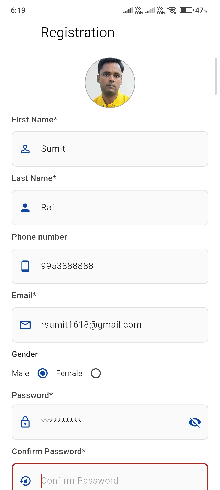
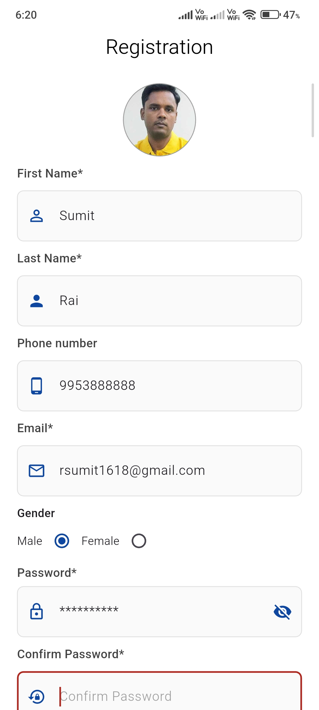
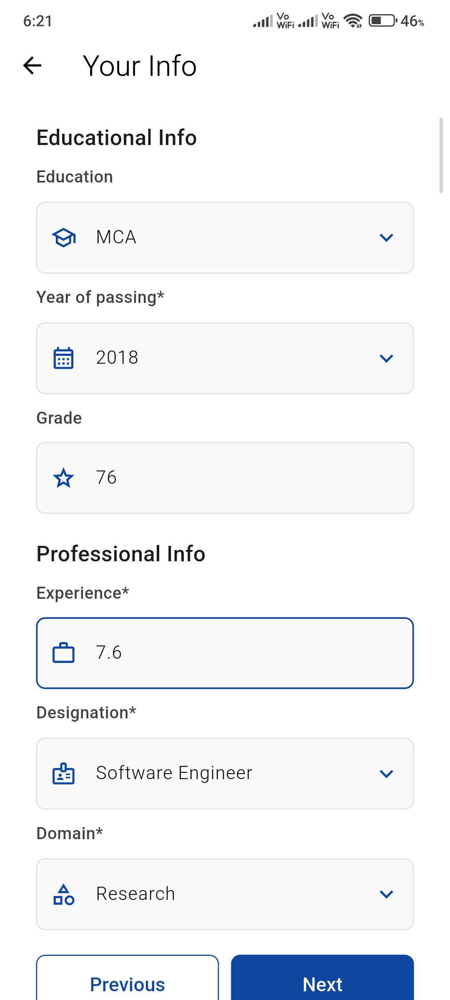
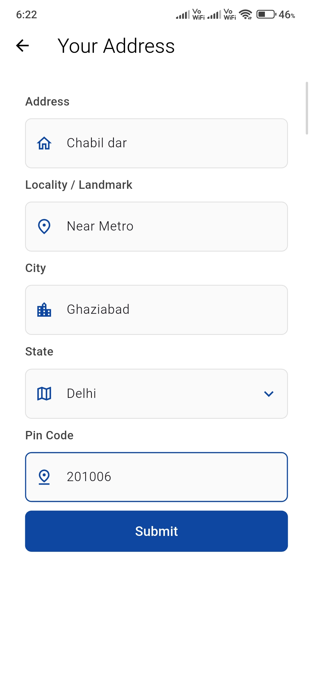
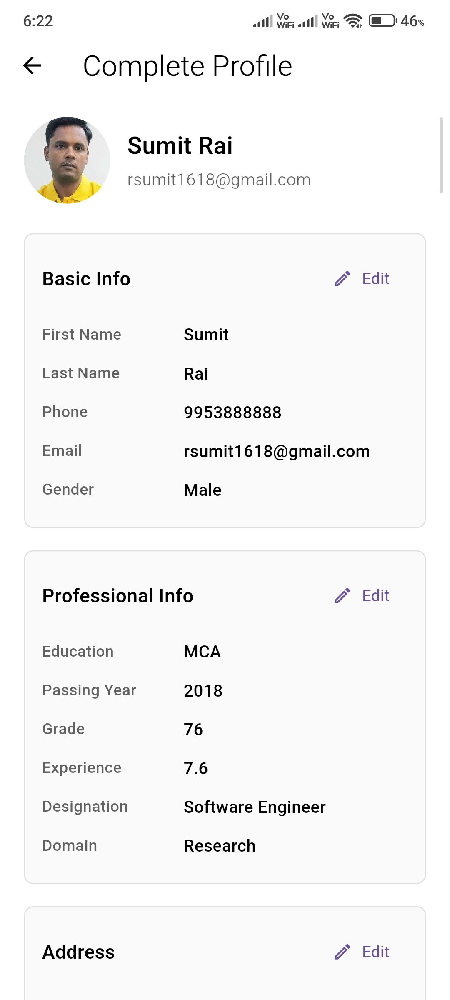

# Neosoft Technologies Assignment - Flutter Registration App

This project is a multi-step Flutter registration application created for the
Neosoft Technologies assignment. The app collects basic user details,
professional information, address information, and then displays a complete
profile summary where the entered data can be reviewed and edited.

The project has been upgraded to work with the current Flutter and Android
tooling, with responsive UI improvements, image upload support, form
validation, clean field icons, and a final review screen.

## App Preview

<p align="center">
  
  
  
  
  
</p>

## Features

- Multi-step registration flow
- Profile image upload from gallery
- Basic information form
- Education and professional details form
- Address details form
- Final complete profile summary screen
- Edit support when navigating back to previous screens
- Responsive sizing using `flutter_screenutil`
- Form validation for required fields, email, phone, password, and pin code
- Clean input icons based on field type
- Modern Android build configuration

## Screens

### 1. Registration

Collects the user's basic details:

- Profile image
- First name
- Last name
- Phone number
- Email
- Gender
- Password
- Confirm password

### 2. Professional Info

Collects education and work-related details:

- Education
- Year of passing
- Grade or percentage
- Experience
- Designation
- Domain

### 3. Address

Collects location information:

- Address
- Locality or landmark
- City
- State
- Pin code

### 4. Complete Profile

Shows all submitted information in one place. Each section has an edit action,
so the user can go back and update previously entered data.

## Tech Stack

- Flutter
- Dart
- GetX
- Dio
- Image Picker
- Image Cropper
- Permission Handler
- Flutter ScreenUtil
- Android Gradle Plugin

## Packages Used

| Package | Purpose |
| --- | --- |
| `get` | Navigation, dependency lookup, and reactive state |
| `flutter_screenutil` | Responsive UI scaling across screen sizes |
| `image_picker` | Pick profile image from gallery |
| `image_cropper` | Crop selected image |
| `permission_handler` | Permission handling support |
| `dio` | HTTP client dependency, available for API integration |
| `flutter_lints` | Dart and Flutter lint rules |

## Project Structure

```text
lib/
  core/
    constants.dart
    enums.dart
    extentions.dart
    field_validator.dart
    image_picker_utils.dart
    utils.dart
    value_objects.dart

  model/
    user_model.dart

  presentation/
    binding/
    registration/
      basic_info_page.dart
      professional_info_page.dart
      address_info_page.dart
      summary_page.dart
    widgets/
      custom_alert_dialogue.dart
      custom_button.dart
      custom_input_widgets.dart

  view_models/
    basic_info_page_controller.dart
    professional_info_page_controller.dart
    address_info_page_controller.dart
```

## Code Explanation

### `main.dart`

The application starts from `main.dart`. It wraps the app with
`ScreenUtilInit`, which helps scale text, spacing, and widget sizes based on
the device screen. The first screen shown is `BasicInfoPage`.

### View Models

The app uses GetX controllers as view models:

- `BasicInfoPageController`
- `ProfessionalPageController`
- `AddressPageController`

These controllers hold `TextEditingController` objects, form keys, selected
gender state, image path state, and validation submit methods. Because the
controllers remain available through GetX navigation, the entered values stay
available when the user goes back to edit previous screens.

### Form Widgets

Reusable widgets are kept inside `presentation/widgets`:

- `CustomTextField`
- `CustomPasswordField`
- `CustomDropdownTextField`
- `AppButtonOne`
- `AppButtonTwo`
- `CustomRadioButton`

This keeps the screen code cleaner and makes the UI consistent across all form
pages.

### Validation

Validation logic is kept in `core/field_validator.dart`. The app validates:

- Required text fields
- Email format
- Phone number length
- Password rules
- Confirm password matching
- Pin code length

### Image Upload

Image upload is handled through `core/image_picker_utils.dart`. The app uses
`image_picker` to select an image from the gallery and stores the selected image
path in the basic info controller. The avatar only renders a file image after a
valid path exists, preventing empty-path image errors.

### Navigation

Navigation is handled with GetX:

- `Get.to()` moves to the next screen.
- `Get.back()` returns to the previous screen while preserving form values.
- The summary page uses edit actions to return to the relevant form section.

## How to Run

```bash
flutter pub get
flutter run
```

## How to Build APK

```bash
flutter build apk --release
```

The generated APK will be available at:

```text
build/app/outputs/flutter-apk/app-release.apk
```

## Verification

The project was checked with:

```bash
flutter test
flutter analyze
flutter build apk --release
```

`flutter test` passes. `flutter analyze` may still show non-blocking style
warnings from the original assignment code, but the app builds and runs.

## Assignment Summary

This Flutter app demonstrates a complete registration workflow with clean UI,
state preservation, validation, image selection, responsive design, and final
data review. It is structured in a simple MVVM-like style using GetX
controllers and reusable presentation widgets.
